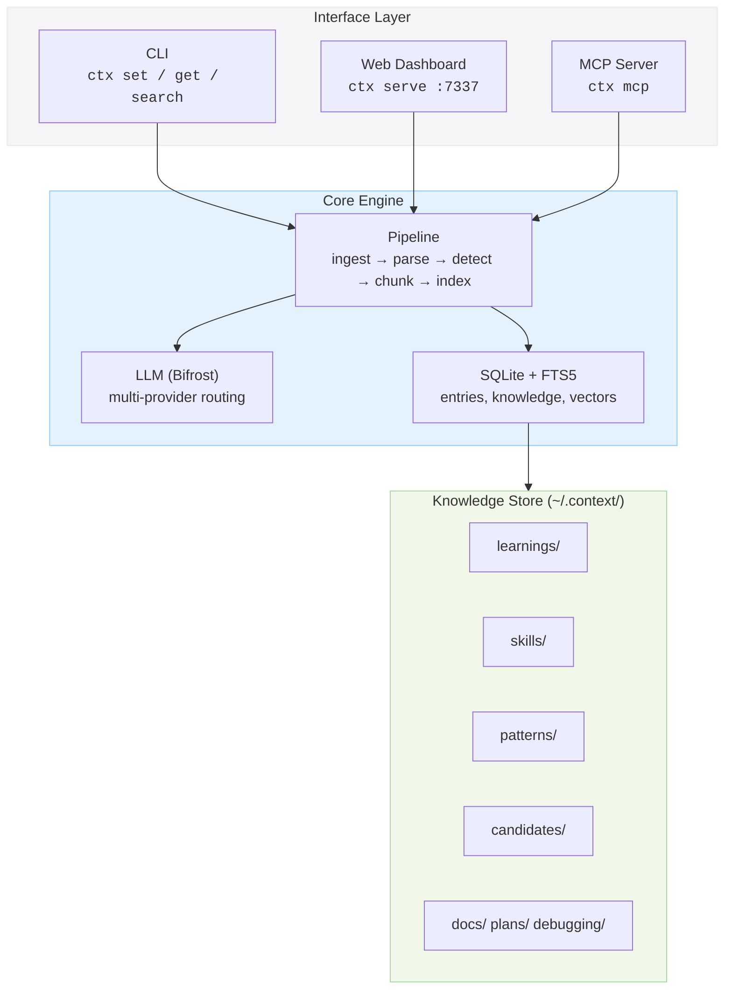
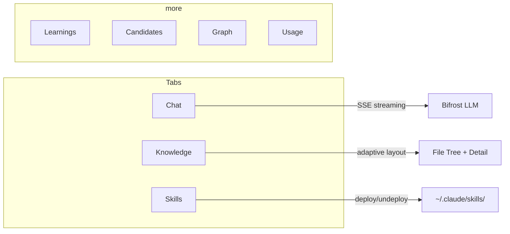
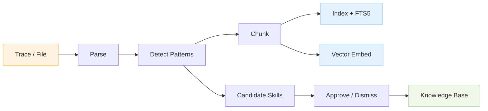
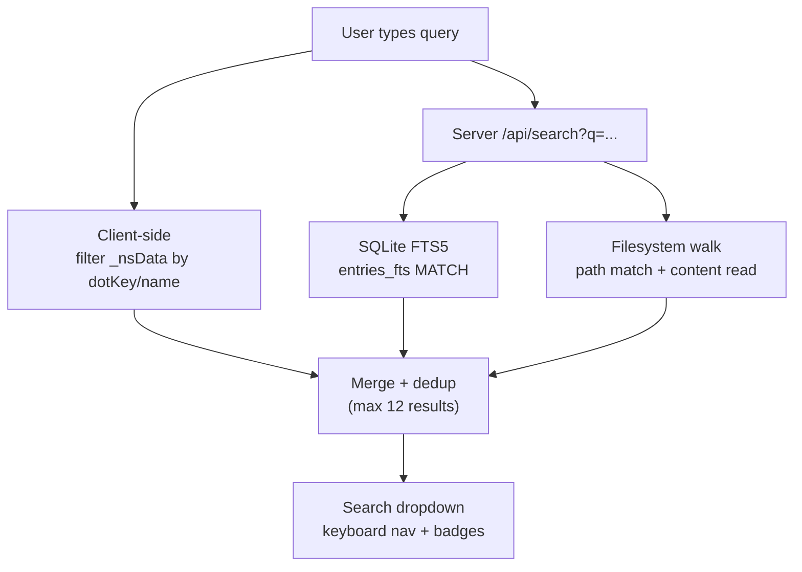

# ctx

Personal knowledge infrastructure. Park knowledge, codify workflows as skills, and query everything through a chat interface.

```
ctx set react.hooks.rules "Always call hooks at the top level"
ctx search "hooks"
ctx serve        # opens the web dashboard
ctx mcp          # MCP server for Claude Code / Cursor
```

---

## Architecture



## Web Dashboard

The dashboard (`ctx serve`) provides three main tabs plus secondary views:



### Chat Tab

Conversational interface backed by SSE streaming. Ask about your past sessions, patterns, and stored knowledge. Select model and project tag per query.

### Knowledge Tab

Adaptive GNS-style layout:

```
+--------------------------------------------------+
|  Search keys or content...                        |   <- FTS + path search
+--------------------------------------------------+
|  ctx > learnings > trace-2026-02-07               |   <- breadcrumb nav
+--------------------------------------------------+
|                                                    |
|  > candidates              7                       |   Full-width tree
|    debugging                                       |   (no detail panel)
|    docs                                            |
|  > learnings              41                       |
|    patterns                                        |
|  > skills                                          |
|                                                    |
+--------------------------------------------------+

  Click a file to open detail panel:

+------------------+-------------------------------+
| > candidates   7 | learnings.trace-2026...       |
|   debugging      | [PRETTY] [RAW] [copy]    x   |
|   docs           |                               |
| > learnings   41 | # Trace Summary               |
|   > claude-tr... | workspace: /Users/ben/coding  |
|     claude-tr... | source: claude-code           |
|   patterns       | tags: [completed]             |
+------------------+-------------------------------+
     280px                    flex
```

- **Search** merges client-side path matching (instant) with server-side file content search (debounced 150ms)
- **Copy** button copies raw markdown to clipboard
- **Park** new knowledge via the `+ park` button with namespace + key + content

### Skills Tab

Three sections for deployable items:

```
+--------------------------------------------------+
| RULES                                             |
|  No rules yet.                                    |
+--------------------------------------------------+
| SKILLS                                            |
|  ctx-cli-usage   skills/internal   LOCAL  [deploy]|
|  cra-mr-synth    skills/external   LOCAL  [deploy]|
+--------------------------------------------------+
| MCPS                                              |
|  No MCPs yet.                                     |
+--------------------------------------------------+
```

Deploy pushes a skill's `.md` file to `~/.claude/skills/` so Claude Code picks it up. Undeploy removes it.

## Data Pipeline



**Capture hooks** watch for Claude Code session completions and automatically ingest traces through the pipeline: parse JSONL, detect reusable patterns via LLM, generate candidate skills, and index everything for search.

## Search

Two-tier search across all knowledge:



## Project Structure

```
ctx/
  cmd/ctx/main.go          # entrypoint
  internal/
    cli/cli.go             # cobra commands: set, get, search, list, tree, serve, mcp...
    config/config.go       # ~/.context/ paths, TOML config
    store/                 # SQLite + FTS5 (entries, knowledge, vectors, traces)
    pipeline/              # ingest → parse → detect → chunk → index → synthesize
    llm/llm.go             # Bifrost multi-provider LLM client
    vectors/vectors.go     # embedding + cosine similarity search
    capture/               # hook.go (install), watcher.go (watch for traces)
    web/                   # server.go (API routes), index.html (embedded SPA)
    mcp/server.go          # MCP stdio server for Claude Code / Cursor
  prompts/                 # system + user prompt templates for LLM stages
```

## Install

```bash
go install github.com/benyadabest/ctx/cmd/ctx@latest
```

Or build from source:

```bash
git clone git@github.com:benyadabest/ctx.git
cd ctx
go build -o ctx ./cmd/ctx
```

## Quick Start

```bash
# Store knowledge
ctx set react.hooks.rules "Always call hooks at the top level"
ctx set go.errors.wrapping "Wrap errors with fmt.Errorf and %w"

# Retrieve
ctx get react.hooks.rules
ctx search "hooks"
ctx list react
ctx tree

# Web dashboard
ctx serve                  # http://localhost:7337

# MCP server (for Claude Code)
ctx mcp

# Capture Claude Code sessions
ctx capture install        # installs post-session hook
ctx capture watch          # watches for new traces
```

## Design

- **Apple-inspired UI** — frosted glass header, Inter/SF Pro typography, #0071e3 blue accent, shadows not borders
- **Adaptive layout** — full-width tree by default, splits to 280px + detail only on file select
- **Zero config** — everything lives in `~/.context/`, SQLite DB auto-creates
- **LLM-agnostic** — Bifrost routes to Anthropic, OpenAI, Google, AWS Bedrock, Azure
- **Filesystem-first** — knowledge stored as `.md` files, searchable by path and content
