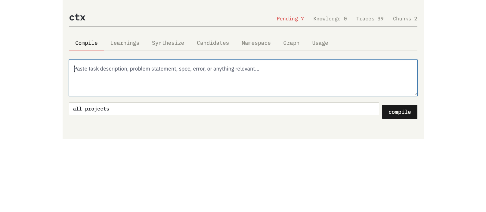
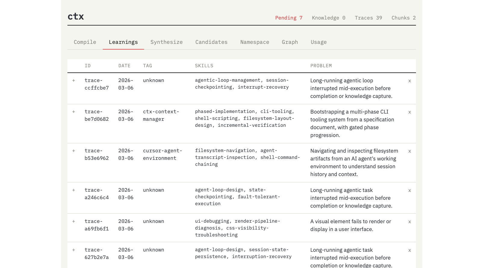
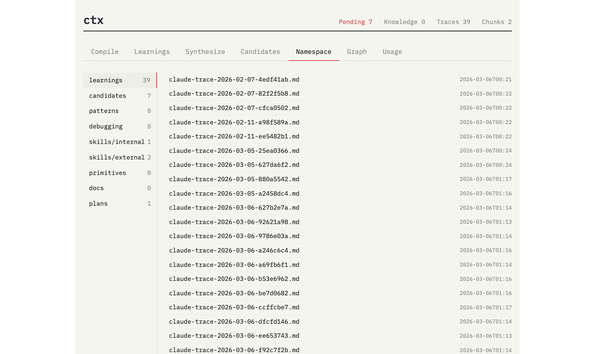
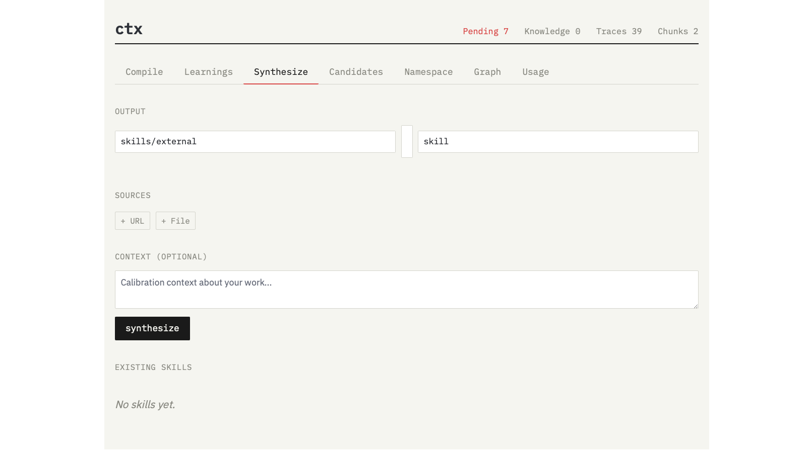

# ctx

Personal knowledge infrastructure that captures AI dev sessions & external sources, indexes them, and compiles relevant context for future sessions.

https://ben.shvartsman.com/writings/ctx-continual-learning-for-agents.html

## What it does

1. **Captures** Cursor and Claude Code sessions automatically via hooks and file watchers
2. **Summarizes** each session into portable patterns and domain-specific knowledge using LLM extraction
3. **Embeds** summaries and documents for semantic search
4. **Detects** recurring patterns across sessions and surfaces them as candidates for promotion
5. **Compiles** grounded context briefings — given a task description, returns an approach paragraph, relevant skills/learnings, and open questions drawn from your accumulated knowledge
6. **Synthesizes** new skills from external sources (URLs, docs) and existing knowledge
7. **Tracks** API usage with per-call token counts and costs

## Architecture

```
capture → ingest → summarize → embed → detect → compile
                                         ↓
                                    synthesize
```

All scripts are independent — no imports between them except `model_router.py`. SQLite is the only data store. Model routing is centralized through a single `call(task, prompt, system)` interface that automatically logs usage.

### Scripts

All pipeline scripts live in `src/`. The `ctx` CLI at the root delegates to them.

| Script | Purpose |
|---|---|
| `ctx` | CLI entry point (root) |
| `src/model_router.py` | Routes LLM calls by task to configured model, logs usage |
| `src/ctx-hook.py` | Cursor hook handler (stdin JSON → raw/) |
| `src/ctx-ingest.py` | Parse raw sessions → learnings/ + SQLite |
| `src/ctx-watcher.py` | Watches Claude Code sessions for changes |
| `src/ctx-summarize.py` | Two-target extraction: portable + domain |
| `src/ctx-embed.py` | Embedding, chunking, and stale pruning |
| `src/ctx-discover.py` | List available sessions without ingesting |
| `src/ctx-backfill.py` | Ingest historical sessions |
| `src/ctx-detect.py` | Pattern detection across traces |
| `src/ctx-compile.py` | Grounded briefing compiler |
| `src/ctx-synthesize.py` | Skill/pattern synthesis from sources |
| `src/ctx-serve.py` | Web UI (FastAPI, port 7337) |

### Namespaces

```
~/.context/
├── learnings/        # trace summaries (auto-generated)
├── candidates/       # detection output (pending approval)
├── patterns/         # promoted cross-project patterns
├── debugging/        # recurring debugging strategies
├── skills/internal/  # promoted from traces via detection
├── skills/external/  # synthesized from external sources
├── primitives/       # reusable code/config fragments
├── docs/             # reference documents
└── plans/            # implementation plans
```

## Setup

```bash
pip3 install toml watchdog sentence-transformers fastapi uvicorn
```

Create `~/.context/ctx.toml` with your config (see `ctx.toml` sections in the rebuild plan or run `ctx status` for defaults).

Set your API key:
```bash
export ANTHROPIC_API_KEY="sk-..."
```

## Usage

```bash
# Pipeline
ctx status                              # pipeline health, counts, processes
ctx backfill --after 2026-01-01         # ingest historical sessions
ctx detect --force                      # run pattern detection
ctx compile "build X" --tag my-project  # compile context briefing
ctx embed --all                         # re-embed everything (also prunes deleted files)
ctx serve                               # start web UI

# Knowledge management
ctx push doc.md --namespace docs        # add file (auto-embeds + adds to knowledge table)
ctx push https://example.com -n docs    # add URL
ctx note "TIL: something useful"        # quick note (auto-summarizes + embeds)
ctx tag learnings/file.md my-tag        # add tags to frontmatter + knowledge table
ctx forget trace-abc123                 # remove a trace + all associated data
ctx rm plans/old-plan.md                # remove a namespace file + all DB entries

# Synthesis
ctx synthesize --source https://example.com --output skills/external/new-skill --type skill
```

## Web UI

`ctx serve` starts the UI at http://localhost:7337 with tabs:

- **Compile** — paste a task, get a grounded briefing with approach paragraph and sources
- **Learnings** — browse and delete trace summaries
- **Synthesize** — create skills from URLs/files
- **Candidates** — approve or dismiss detected patterns
- **Namespace** — browse, upload, drag-and-drop files across namespaces
- **Graph** — Mermaid visualization of skill/pattern co-occurrence
- **Usage** — API call tracking with costs by task and day

### Compile



### Learnings



### Namespace Browser



### Synthesize



## Data lifecycle

- **Adding**: `ctx push`, `ctx note`, and `ctx backfill` auto-embed new content
- **Editing**: Edit files directly, then `ctx embed --all` to re-index
- **Deleting**: `ctx forget` removes traces; `ctx rm` removes namespace files — both clean up all associated DB entries (chunks, knowledge, embeddings). `ctx embed --all` also prunes any stale chunks as a safety net
- **Reindexing**: `ctx embed --all` re-embeds everything and cleans up stale references

## Dependencies

- Python 3.9+
- `toml` — config parsing
- `watchdog` — file system watching
- `sentence-transformers` — local embeddings (all-MiniLM-L6-v2)
- `fastapi` + `uvicorn` — web UI
- Anthropic API key for LLM calls (or Ollama for offline mode)
